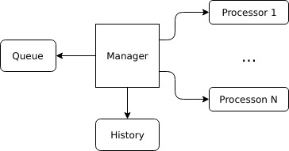

# Crawler

## Description

### Research: what Google says about sitemaps?

Google is by many recognized as the best search service around the world. They have some useful information about how to prepare the sitemap. We would like to optimize it particularly for their crawler which would result in a higher chance of a greater traffic (and therefore better growth).

https://support.google.com/webmasters/answer/183668

#### To sum up:

Different formats:
 - XML
 - Plaintext
 - RSS

Guidelines:
 1. use consistent, fully-qualified, canonical URLs
 2. remove redundant GET params (like session IDs)
 3. specify language versions if possible (hreflang annotation)
 4. use utf-8 encoding
 5. should be limited to 50k URLs and 50MB size when uncompressed (if we need more, then specify the sitemap of sitemaps -- Yahoo is a good example https://www.yahoo.com/news/weather/sitemap.xml)

## Design

## Architecture

At the beginning let's take a look from the bigger perspective -- architecture.
We are supposed to write a crawler that produces sitemaps, but we don't know the source of requests / inputs (what queries our application?). It might be through Kafka, it might HTTP requests.
We also don't know what we should do with the results (send sitemap to S3 / return as HTTP response body).

Goal: application should be easily extendable to provide functionality of creating sitemaps by different ways of communication (HTTP / TCP / Kafka / Command Line).

## Solution

### Structure

 - `cmd`: created to allow different implementations, for instance CLI and HTTP server
 - `internal`: folder contains all Go code specifically for this project.
    - `adapter` should contain implementations for dependencies (http clients, repositories as a wrapper to database)
    - `app`: all domain logic code
    - `transport`: transport layer (http, grpc) implementation as to allow communication with this project
 - `pkg`: anything non-specific for this project

### Algorithm

High level description of the algorithm:

Brief description of functionalities:
 - Manager: manages the algorithm flow. Knows when the sitemap is fully generated.
 - Queue: (FIFO) queue for storing URLs to process.
 - History (hashmap) for fast lookup if URL was already processed.
 - Processor: process the URL (fetching HTTP response body + extracting the links).

#### Description of the flow

##### Manager

The most important component is the Manager. It manages everything.
 1. It creates: Queue for storing links to process and History for the fast lookup if link was already processed,
 2. Fetches the /robots.txt for 'Disallow' rules ('Allow' are not supported yet),
 3. Creates N processors that will be responsible for asynchronous processing of the URLs (fetch content + extract URLs),
 4. Based on the channels: sends jobs and receives the results from the processors. In case result was received, use History
    to filter URLs and add the new URLs to the Queue.

Manager has the full knowledge of what's going on -- including how many processors are currently working and how many items
are left in the queue to process. Therefore it can determine if the sitemap was fully generated and end the algorithm then.

##### Queue

I decided to use a FIFO queue implemented on slices. We need two operations on the queue:
 - Pop: takes first element and removes it from the queue
 - Push: adds a new element at the end

The downside of the slices implementation as the Queue is the `slice = slice[1:]` operation. It won't reallocate memory after many
of this operations -- meaning we won't free up some of the memory even if we don't use it.

##### History

History is a fast lookup for the processed/queued URLs. `map` in Golang are implemented as hashmaps, so each lookup / adding new item should take O(1) time on average.

##### Processor

Worker component used for processing URLs. Implementation over channels has an advantage that we don't need to manage processors in the Manager. If processor will be ready to process, it will simply read the job from the channel.
It also allows to use asynchronous processing, so Manager can create as many processors as needed.

This component shouldn't become complicated. It's function is to use other packages to execute certain actions.

If the provided context is Done(), processor ends working.

### Problems

 0. How to normalize to canonical form?
 1. How to distinguish if GET param is important or not? (Related to 0.)
    - Sites use the GET params for routing / loading articles (example: http://www.informatyka.mimuw.edu.pl/?q=algorytmy_i_struktury_danych).
    - Sites might add GET params for tracking their users (as Facebook does with fbid).
 2. Sites might generate pages as we scrape them (https://page.com/?p=n points to https://page.com/?p=n+1)
 3. Sites might host pages that are enormously large. What if someone hosts all Game of Thrones seasons (or worse -- child porn)? We don't want to fetch all of it.
 4. Modern sites might require rendering (with loading additional data).
 5. Traffic produced by a crawler might be classified as a Denial of Service attack (you specified that it should be as fast as possible).
 6. Relative links should be expanded to the normal form. (https://wp.pl/blog/../blog/team/ -> https://wp.pl/blog/team/).
    Solution: I use the url.Resolve method to evaluate the relative connections.
 7. `<a href="">` not always contain a link to a website. Sometimes there are phone numbers / webviews.
 8. URLs may return 5xx, therefore we should have retry mechanism.
 9. URLs might be redirected, therefore we should also resolve redirections.
 10. Robots: we should also follow 'Allow' rules.

### Speed

Crawler is mostly limited by response times (and bandwith). If you would like to make it faster, then increase the number of processors.

If you wonder, the Manager might become the bottleneck, because it needs to manage all processors. But to be honest, I doubt you will reach the point where the Manager component becomes an issue. After all it's the tool for generating the sitemaps and not the DoS attack.

## TODO

 - profile the application to validate with expectations
  I expect the memory to grow a lot faster than CPU usage. CPU is limited by the number of processors. Memory will be used accordingly to the connections graph (the more connections to different pages, the faster memory resources will grow).
 - k8s, terraform deployment?
